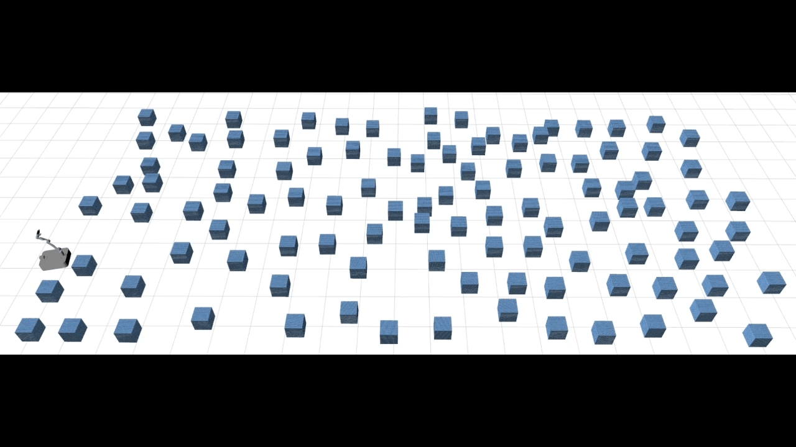

# MM-with-Whole-body-Safety

# We have published the whole project in the branch code. Installation and user guide coming soon. Later, we will add acknowledgements for the projects that have been applied by us. 

Mobile manipulators typically encounter signifi-
cant challenges in navigating narrow, cluttered environments
due to their high-dimensional state spaces and complex kine-
matics. While reactive methods excel in dynamic settings, they
struggle to efficiently incorporate complex, coupled constraints
across the entire state space. In this work, we present a novel
local reactive controller that reformulates the time-domain
single-step problem into a multi-step optimization problem
in the spatial domain, leveraging the propagation of a serial
kinematic chain. This transformation facilitates the formulation
of customized, decoupled link-specific constraints, which is
further solved efficiently with augmented Lagrangian differen-
tial dynamic programming (AL-DDP). Our approach naturally
absorbs spatial kinematic propagation in the forward pass
and processes all link-specific constraints simultaneously during
the backward pass, enhancing both constraint management
and computational efficiency. Notably, in this framework, we
formulate collision avoidance constraints for each link using
accurate geometric models with extracted free regions, and
this improves the maneuverability of the mobile manipulator
in narrow, cluttered spaces. Experimental results showcase sig-
nificant improvements in safety, efficiency, and task completion
rates. These findings underscore the robustness of the proposed
method, particularly in narrow, cluttered environments where
conventional approaches could falter.

## Results

### Cluttered Forest 

In the cluttered forest simulation experiment, we aim to demonstrate the robustness and effectiveness of our method. We test it in a 20 m × 10 m × 3 m forest, where obstacles are randomly generated at two different densities: 0.4 obstacles/m2 and 0.7 obstacles/m2. Each obstacle is a 20 cm×20 cm×20 cm block.

---

### Multifaceted Task 

In this multifaceted task, we design two common elements: a floating bar and three-layer bookcases. These elements are used to validate the robot’s capabilities in locomotion, manipulation, and collision avoidance. 

---

### Real-World Experiments  

We deploy our controller on a mobile manipulator in a 5 m × 9 m cluttered indoor environment.

 
 
 
 

We introduce dynamic obstacles to evaluate the system’s capability for dynamic obstacle avoidance. The location of dynamic obstacles is captured by a motion capture system, and a virtual point cloud of obstacle information is generated at those locations and fed into the algorithm to simulate real obstacles.

## Implementation
Code will be released soon.

## Authors

- [@Chunxin Zheng](czheng739@connect.hkust-gz.edu.cn)

Feel free to contact me if you have any questions regarding the implementation of the algorithm.
