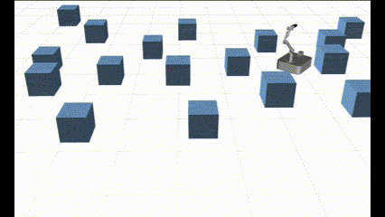

# MM-with-Whole-body-Safety

Mobile manipulators typically encounter signifi-
cant challenges in navigating narrow, cluttered environments
due to their high-dimensional state spaces and complex kine-
matics. While reactive methods excel in dynamic settings, they
struggle to efficiently incorporate complex, coupled constraints
across the entire state space. In this work, we present a novel
local reactive controller that reformulates the time-domain
single-step problem into a multi-step optimization problem
in the spatial domain, leveraging the propagation of a serial
kinematic chain. This transformation facilitates the formulation
of customized, decoupled link-specific constraints, which is
further solved efficiently with augmented Lagrangian differen-
tial dynamic programming (AL-DDP). Our approach naturally
absorbs spatial kinematic propagation in the forward pass
and processes all link-specific constraints simultaneously during
the backward pass, enhancing both constraint management
and computational efficiency. Notably, in this framework, we
formulate collision avoidance constraints for each link using
accurate geometric models with extracted free regions, and
this improves the maneuverability of the mobile manipulator
in narrow, cluttered spaces. Experimental results showcase sig-
nificant improvements in safety, efficiency, and task completion
rates. These findings underscore the robustness of the proposed
method, particularly in narrow, cluttered environments where
conventional approaches could falter.

## Example

---

### Cluttered Forest 4X 

<video width=90% controls >
  <source src="./readme_doc/task1.mp4" type="video/mp4">
</video>

Cluttered forest video

---

### Multifaceted Task 1X

<video width=90% controls >
  <source src="./readme_doc/task2.mp4" type="video/mp4">
</video>

Multifaceted taks video

---

### Real World 4X 

<video width=90% controls >
  <source src="./readme_doc/real_world_4x.mp4" type="video/mp4">
</video>

Real world experiment video

### Dynamic Obstical 4X

<video width=90% controls >
  <source src="./readme_doc/task3.mp4" type="video/mp4">
</video>

Dynamic obstical experiment video

## Implementation
Code will be released soon.

## Authors

- [@Chunxin Zheng](czheng739@connect.hkust-gz.edu.cn)

Feel free to contact me if you have any questions regarding the implementation of the algorithm.
